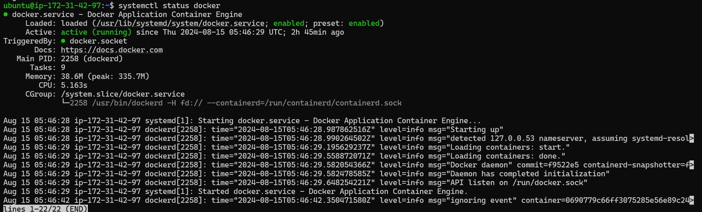
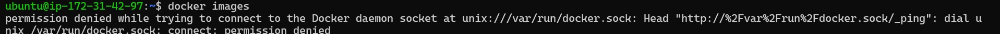
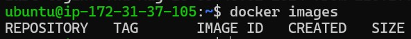

<h1>Post Installation</h1>
<h2>Verify if Docker is running</h2>
<pre><code>systemctl status docker</code></pre>

<h2>By default, only root user can connect to the Docker Deamon</h2>

<h2>Allow other users to Access Docker Deamon</h2>
<pre><code>sudo usermod -aG docker ubuntu</code></pre>

Logout and login again after running command above

<pre><code>docker images</code></pre>

Successfully!

<h2>Using user data to do the prerequisite</h2>

Thanks to the cloud technology, we can add bootstrap script(named "user data" in AWS) on machine born.
This script will run once only at the beginning of life by using root account.
You may find details on <a href="https://www.w3schools.com">AWS</a> if you want to interested in this topic. 

<pre><code>#!/bin/bash
apt-get update
apt-get install ca-certificates curl -y
install -m 0755 -d /etc/apt/keyrings
curl -fsSL https://download.docker.com/linux/ubuntu/gpg -o /etc/apt/keyrings/docker.asc
chmod a+r /etc/apt/keyrings/docker.asc
echo \
  "deb [arch=$(dpkg --print-architecture) signed-by=/etc/apt/keyrings/docker.asc] https://download.docker.com/linux/ubuntu \
  $(. /etc/os-release && echo "$VERSION_CODENAME") stable" | \
  tee /etc/apt/sources.list.d/docker.list > /dev/null
apt-get update
apt-get install docker-ce docker-ce-cli containerd.io docker-buildx-plugin docker-compose-plugin -y
usermod -aG docker ubuntu
</code></pre>
