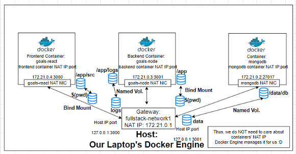

<h1> Understanding Data</h1>

 >
<h2>1. Application</h2>
<h2>[Code + Environment]</h2>
<h2>Written & provided by you (the developer)</h2>
<h2>Added to image & container in Build phase</h2>
<h2>"Fixed" code: Cannot be changed once image is built</h2>
 
<h2>We have to rebuild our docker image using</h2>
<h2>docker build -t berlinleephoenix/ourImage -f ./Dockerfile</h2>
 
<h2>Hence, code inside a docker image = Read-only</h2>
 
<h2>2. Temporary App Data</h2>
<h2>e.g. entered user input</h2>
<h2>Fetched / Produced in running containers</h2>
<h2>Stored in memory / temporary files</h2>
<h2>Dynamic & changing but cleared regularly </h2>
<h2>once we shut down our containers</h2>
<h2>Read + Write,</h2>
<h2>temporary, hence stored in Containers</h2>
 
<h2>Container Layer 3: Image Layer 3 (Read + Write)</h2>
<h2>Container Layer 2: Image Layer 2</h2>
<h2>Container Layer 1: Image Layer 1</h2>
 
<h2>3. Permanent App Data</h2>
<h2>e.g. User Accounts</h2>
<h2>Fetched / Produced in running containers</h2>
<h2>Stored in files or a Database</h2>
<h2>Must NOT be lost if a container stops / restarts</h2>
<h2>Read + Write,</h2>
<h2>Permanent, stored with Containers & Volumes</h2>
 
<h2>A file with new contents will be stored temporarily in temp</h2>
<h2>server.js checks whether this temp file is stored in feedback folder</h2>
 
<h2>Build Image</h2>
<h2>cd managingData/data-volumes-</h2>
<h2>docker build -t feedback-node -f ./Dockerfile .</h2>
 
<h2>Run our newly created docker image feedback-node in:</h2>
<h2>-p = localPort:containerPort => 3002:3002</h2>
<h2>-d = detach mode</h2>
<h2>--name = naming our new container called feedback-app </h2>
<h2>--rm = remove our container upon stopping our container named feedback-app</h2>
<h2>to be built using docker image feedback-node</h2>
 
<h2>docker run -p 3002:3002 -d --name feedback-app --rm feedback-node;</h2>
 
<h2>Check running containers</h2>
<h2>docker ps -a;</h2>
<h2></h2>
<h2>Looking at code in server.js</h2>
<h2>Once we 'Save' a Feedback that saved </h2>
<h2>Title: testing</h2>
<h2>Document Text: testing</h2>
<h2>We can browse it using localhost:3002/feedback/testing.txt</h2>
 
<h2>Containers have no connections with our host machine</h2>
<h2>once we docker run our container using a docker image</h2>
 
<h2>Stopping a container Will NOT remove the files saved in it</h2>
<h2>Removing a container will remove the files saved in it</h2>
 
<h2>We will LOSE the files saved in localhost:3002/feedback/testing.txt</h2>
<h2>once we remove that particular docker container feedback-app</h2>
<h2></h2>
<h2>Any new files are only stored in that particular container</h2>
<h2>New Files will NOT be saved into the Read-only docker image</h2>
 
<h1>Solutions</h1>
<h2>Volumes = Storing persistent data</h2>
<h2>Volumes = Folders on our host machine hard drive</h2>
<h2>which are mounted ("mode available", mapped) into containers</h2>
 
<h2>Volumes = persistent even if a container is shut down</h2>
 
<h2>A Container can Write data into a Volume (on our host) and</h2>
<h2>Read data from a Volume (on our host)</h2>

