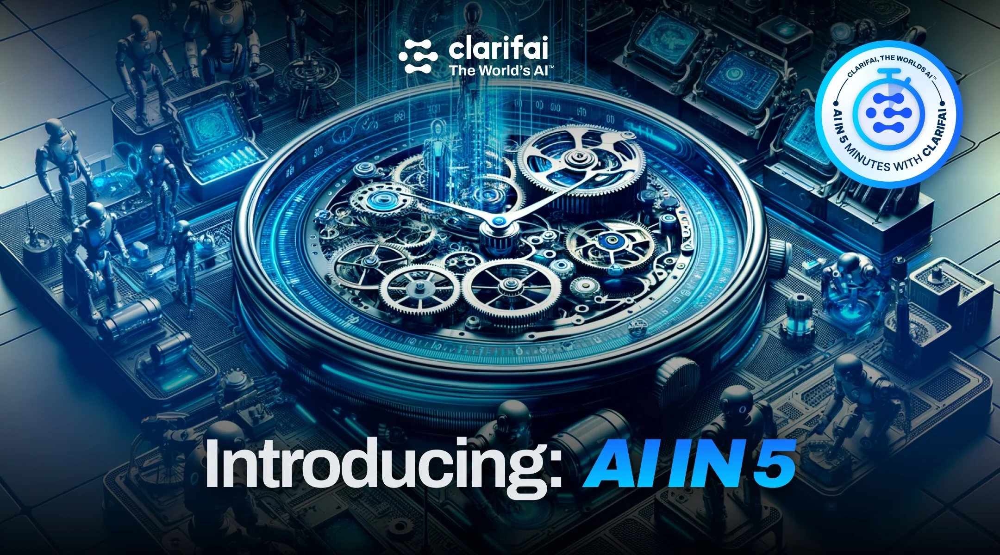
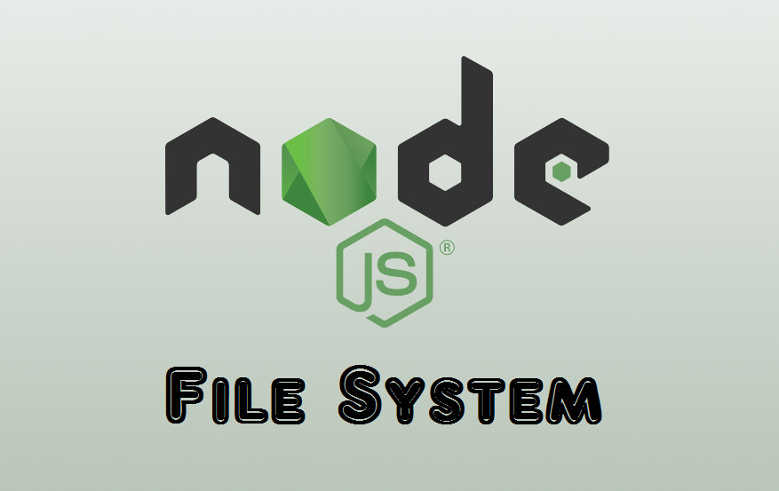
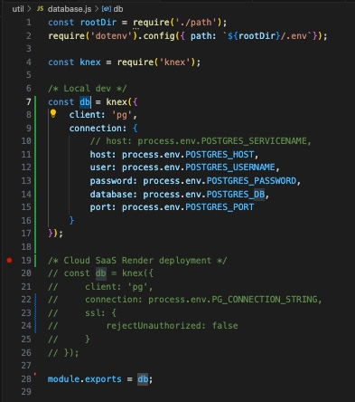

<h3>Technologies used in this Node.js app</h3>
<ul>
    <li>1. Node.js</li>
    
    <li>2. Postgres</li>
    
    <li>3. Clarifai AI APIs</li>
    
    <li>4. Web Scraping using Puppeteer</li>
    
    <li>5. Cloud Software as a Service on Render</li>
    
</ul>

<h3>Node.js is a Server-side programming runtime</h3>

<h3>Node.js also offers File System module to allow building of command tools</h3>

<br/>

<h3>Node.js has a light-weight framework Express for us to build REST APIs</h3>

<br/>

<h3>Express has Requests Validator for validating inputs from Frontend/POSTMAN when building our REST APIs!</h3>

<br/>

<h3>Clarifai provides an end-to-end Full Stack enterprise AI platform to build AI faster</h3>
<h3>Leveraging modern AI technologies like Large Language Modesl (LLM), Generative AI, Retrieval Augmented Genration (RAG), data labeling, inference</h3>


<h3>You man find out more AI models on</h3>
<h3>https://clarifai.com/clarifai/main/models/</h3>
<br>
<h3>Clarifai offers Face Detection models :D</h3>

<br>
<h3>Clarifai now offers GPT-4 model too :D</h3>

<br>

<h3>Puppeteer is a Web Scraping tool used in Node.js</h3>
<h3>It leverages outerHTML to scrap data & images from any websites</h3>


<h3>This Node.js app also allows Registration with Session Cookies</h3>


<h3>Express REST API for Login Session Cookies</h3>


<h2>Download this fun AI Node.js app</h2>

```bash
git clone https://github.com/PhoenixYork166/AI-Recognition-Nodejs-Puppeteer.git;
```

<h2>Start using this Node.js app</h2>

```bash
npm install;
```

```bash
npm start;
```


<br>

<h2>Live Web Server on Cloud:</h2>
<h2>https://ai-recognition-backend.onrender.com/</h2>

<h2>Feel free to test my Node.js app using rootDir/.env</h2>
<h2>The API Key PAT is free of charge</h2>
<h2>My Cloud SaaS Public IP rules are also set</h2>
<h2>So please do not worry about my Cloud Web Service instance security</h2>

<h2>What if you want to explore this Node.js app more with hands-on?</h2>
<h2>You may edit projectFolder/.env parameters</h2>
<h2>You may also edit Postgres connection string using Knex.js inside</h2>
<h2>projectFolder/util/database.js</h2>

<br>

<h2>Postgre Database Administration</h2>

<h2>To enter psql shell environment</h2>

```bash
psql -U postgres -d smart-brain -h 127.0.0.1 -p 5432
```

<h2>To enter psql shell on Cloud SaaS Render.com</h2>


<h2>What if you do not have all the necessary Dev dependencies on your mac OS to start this Node app?</h2>

# 4. Go to ./install-postgresql
## Read through ./install-postgresql/0_postgresql_docs.txt

# 5. Installing mac OS Node.js dev dependencies
## i. Start installing necessary dependencies 'brew' command on your mac OS
```bash
bash ./install-postgresql/1_install-brew.sh;
```

## ii. Start installing 'wget' command on your mac OS
```bash
bash ./install-postgresql/2_install-wget.sh;
```

## iii. Adding 'psql' to your Bash env on your mac OS
```bash
bash ./install-postgresql/3_add-psql-to-bash.sh;
```

## iv. Downloading PSequel GUI (PSequel GUI is still crashing in 2024)...
```bash
bash ./install-postgresql/4_download-psequel-gui.sh;
```

## v. Installing PostgreSQL on your mac OS
```bash
bash ./install-postgresql/5_install-postgres.sh;
```

## vi. Creating a database call 'test' using PostgreSQL on your mac OS
```bash
bash ./install-postgresql/6_createdb-test.sh;
```

# 6. Start re-creating database & tables necessary for starting up this Node app

## i. Start by re-creating database
```bash
bash ./database-recreation/0_create_database_smart-brain.sh;
```

## ii. Re-creating a table called 'users' in our database using Bash
```bash
bash ./database-recreation/1_create_table-users.sh;
```
## or you may run SQL statements declared in 2_create_table-users.sql
```bash
2_create_table-users.sql
```

## iii. Manually re-creating postgres table 'users' in our database for storing bcrypt password hashes => run PostgreSQL inside rootDir/install-postgresql/db-recreation-SQL
```bash
1_create-users.SQL
```

## table 'login'
```bash
2_create_table-login.sql
```

## Follow through all the .SQL files for Postgres db re-creation
## except 15_drop-FUNCTION-and-TRIGGERS

## iv. Verify that we've successfully created a table named 'users' in our database
```bash
bash ./database-recreation/5_verify_schema-users.sh;
```
## Hit 'q' key to exit when we're done verifying

## v. Verify that we've successfully created a table named 'login' in our database
```bash
bash ./database-recreation/6_verify_schema-login.sh;
```
## Hit 'q' key to exit when we're done verifying
