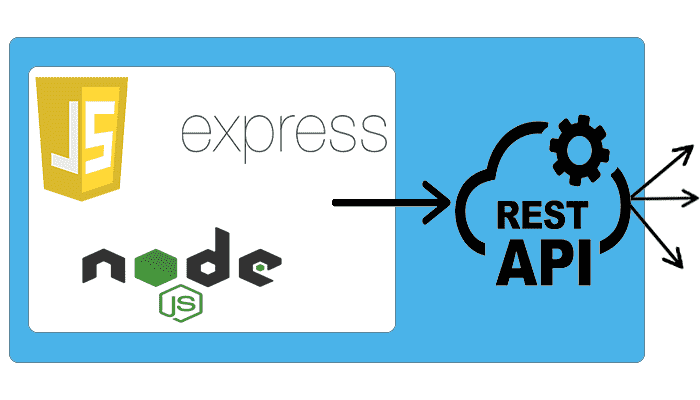
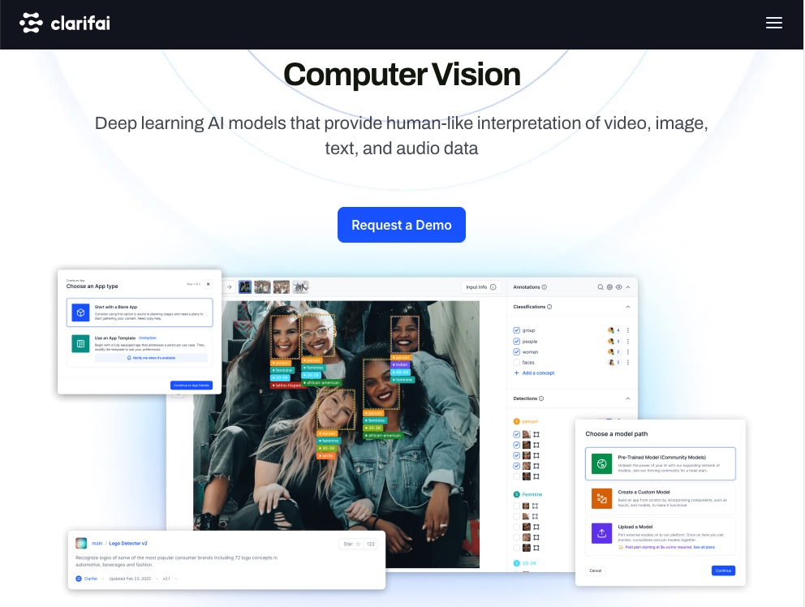
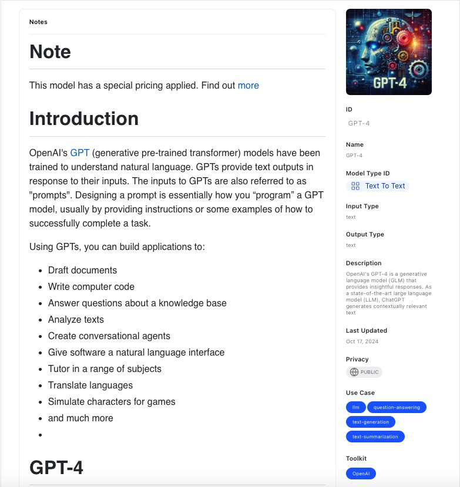
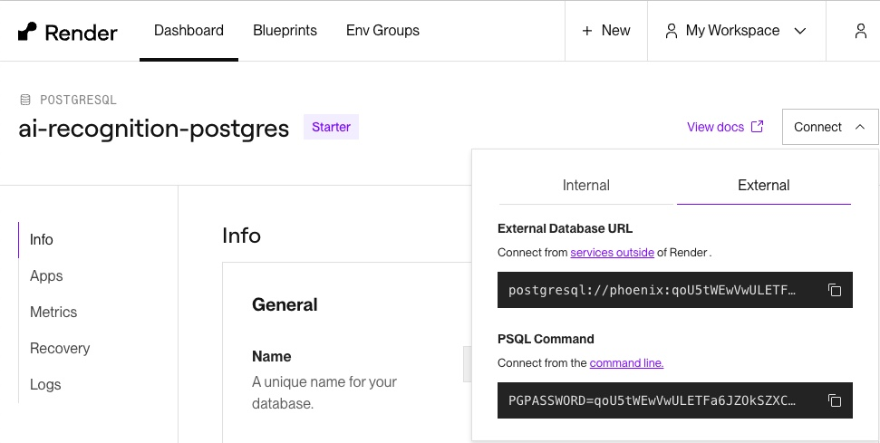

<h3>DevOps Docker practice</h3>
<h3>Start testing this Docker composed app</h3>

```bash
docker compose up --build;
```

<br/>
<ul>
    <li>1. Docker compose</li>
    
    <li>2. React Frontend</li>
    
    <li>3. Node.js</li>
    
    <li>4. Postgres</li>
    
</ul>

<h3>Docker is a technology allowing us to bundle our Full Stack app through Containerization on any platform e.g. Windows, Linux, AWS EC2</h3>

<br/>

<h3>Programming languages involved</h3>
<h3>Node.js is a Server-side runtime for JavaScript</h3>

<h3>Node.js also offers File System module to allow building of command tools</h3>

<h3>Express is a light-weight framework to build REST APIs</h3>

<br/>

<h3>Special Technologies involved</h3>
<h3>Clarifai API provides an end-to-end Full Stack enterprise AI platform to build AI faster</h3>
<h3>Leveraging modern AI technologies like Large Language Modesl (LLM), Generative AI, Retrieval Augmented Genration (RAG), data labeling, inference</h3>


<h3>You man find out more AI models on</h3>
<h3>https://clarifai.com/clarifai/main/models/</h3>
<br>
<h3>Clarifai offers Face Detection models :D</h3>

<br>
<h3>Clarifai now offers GPT-4 model too :D</h3>

<br/>

<h3>Puppeteer is a Web Scraping tool used in Node.js</h3>
<h3>It leverages outerHTML to scrap data & images from any websites</h3>


<h3>This Node.js app secures controllers with JWT</h3>

<br/>

<h2>What if you want to explore this Node.js app more with hands-on?</h2>
<h2>You may edit projectFolder/.env parameters</h2>
<h2>You may also edit Postgres connection string using Knex.js inside</h2>
<h2>projectFolder/util/database.js</h2>

<br>

<h2>Cloud Software as a Service hosting</h2>


<h2>Live React Server on Cloud:</h2>
<h2>https://www.ai-recognition-frontend.com</h2>

<h2>Live Web Server on Cloud:</h2>
<h2>https://www.ai-recognition-backend.com</h2>

<h2>Feel free to test my Node.js app using rootDir/.env</h2>
<h2>The API Key PAT is free of charge</h2>
<h2>My Cloud SaaS Public IP rules are also set</h2>
<h2>So please do not worry about my Cloud Web Service instance security</h2>
<br/>

<h2>Postgre Database Administration</h2>

<h2>To enter psql shell environment in Docker</h2>
<h4>TCP Port 5433 was selected to avoid conflicting with your local Postgres service TCP Port 5432</h4>

```bash
psql -U postgres -d smart-brain -h 127.0.0.1 -p 5433
```

<h2>To enter psql shell on Cloud SaaS Render.com</h2>



##
##
## Start testing this Docker app
```bash
git clone https://github.com/PhoenixYork166/AI-React-Node-Postgres-Docker
```

```bash
cd AI-React-Node-Postgres-Docker
```

# Building this Full Stack app
## 1. Start Docker-compose
```bash
docker compose up -d;
```

##
##
## 2. Check currently running containers
```bash
docker ps -a;
```

##
##
## 3. Inspecting any docker containers status (Frontend/Backend/Database) via logs
## Inspecting Frontend (React.js) container status
```bash
docker logs ai-frontend;
```
## Inspecting Backend (Node.js) container status
```bash
docker logs ai-backend;
```
## Inspecting Database (Postgres) container status
```bash
docker logs ai-postgres;
```

##
##
## 4. Database Administration (Postgres)
## You may enter PostgreSQL database shell (psql) environment for database administration

## This Docker composed Full Stack app mounts PostgreSQL TCP Port 5433
## Instead of TCP Port 5432 on your host machine (macOS/Windows/AWS EC2)
## PostgreSQL password: rootGor
```bash
psql -U postgres -d smart-brain -h 127.0.0.1 -p 5433;
```

## Should you have created any new tables

## Please put all CREATE TABLE .sql files 
## into 
## projectFolder/postgresql/postgres-init/init.sql
## Line 86 -- NEW CREATE TABLE SQL here

## Thus, next time when you recreate this Docker-compose app on other host machines using 
```bash
docker compose up -d;
```
## You'll have all your postgres tables ready

##
##
## 5. Stop Docker-compose
```bash
docker compose down;
```

##
##
## 6. Code changes
## You may add on custom features to this Full Stack app
## Rebuild all docker images for this app
```bash
docker compose down;
docker compose up --build;
```

##
##
## 7. Should you want to start fresh without any existing docker images & docker containers on your host machine 
## Watch out! This will remove all existing docker images on your host!
```bash
docker compose down;
bash ./prune-before-docker-compose-up.sh;
```
